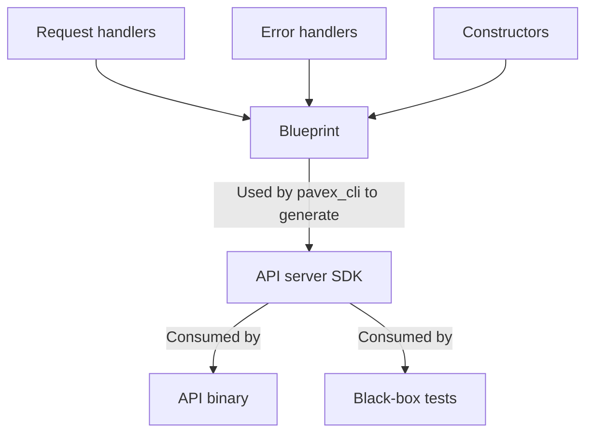
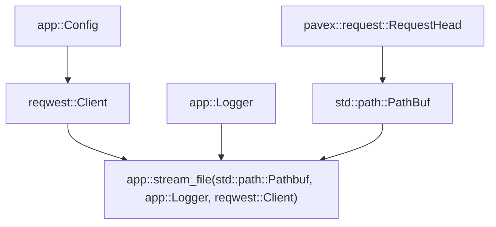

# Architecture

This document gives you a bird-eye view of the architecture of Pavex.  
This is an ideal starting point if you want to contribute or gain a deeper understanding of its inner workings.

## How does Pavex work?

A Pavex project goes through three stages in order to generate runnable application code:

1. Define your request handlers, constructors and error handlers;
2. Combine them together in a `Blueprint`, a representation of the desired API behaviour;
3. Generate the API server SDK via `pavex_cli`, using the `Blueprint` as input.

In a diagram:



To accomplish these tasks, users interact with two crates:

- `pavex`, containing both the machinery to define a `Blueprint` and the "typical" web framework utilities (request, response, extractors, etc.);
- `pavex_cli`, the transpiler.

### `pavex`

You can put most of the machinery in the `pavex` crate in the same bucket of `axum` or `actix-web`: 
the types and abstractions that are needed at runtime to handle incoming requests.

You will see `pavex` in two contexts:

- in the signature and implementations of route handlers and type constructors, written by application developers;
- in the source code generated by `pavex_cli`.

```rust
use pavex::response::Response

// A request handler, returning a response as output.
// The response type is defined in the `pavex` crate.
pub fn stream_file(
    inner: std::path::PathBuf,
    http_client: reqwest::Client,
) -> Response { /* */ }
```

### `pavex::blueprint`

`pavex::blueprint` is the module in the `pavex` crate containing the interface used to craft a `Blueprint`—a specification of 
how the application is supposed to behave at runtime.

```rust
use pavex::blueprint::{Blueprint, Lifecycle};
use pavex::f;

/// The blueprint for our application.
/// It lists all its routes and provides constructors for all the types
/// that will be needed to invoke `stream_file`, our request handler.
///
/// This will be turned into a ready-to-run web server by `pavex_cli`.
pub fn blueprint() -> Blueprint {
    Blueprint::new()
        .constructor(f!(crate::load_configuration), Lifecycle::Singleton)
        .constructor(f!(crate::http_client), Lifecycle::Singleton)
        .constructor(f!(crate::extract_path), Lifecycle::RequestScoped)
        .constructor(f!(crate::logger), Lifecycle::Transient)
        .route(GET, "/home", f!(crate::stream_file))
}
```

A `Blueprint` captures two types of information:

- route handlers (e.g. use `my_handler` for all incoming `/home` requests);
- type constructors (e.g. use `my_constructor` every time you need to build an instance of type `MyType`).

For each type constructor, the developer must specify the lifecycle of its output type:

- _singleton_ - an instance is built once before, the application starts, and re-used for all incoming requests;
- _request-scoped_ - a new instance is built for every incoming request and re-used throughout the handling of that
  specific request;
- _transient_ - a new instance is built every time the type is needed, potentially multiple times for each incoming
  request.

All this information is encoded into the `Blueprint` and passed as input to `pavex_cli` to generate the API server SDK's
source code.

### `pavex_cli` and Pavex

`pavex_cli` is our transpiler, the component in charge of transforming a `Blueprint` into a ready-to-run web
server.  
It is packaged as a binary, a thin wrapper over the (internal) `pavexc` crate.

The transpiler is where most of the complexity lives.  
It must generate:

- a struct representing the application state;
- a function to build an instance of the application state, ahead of launching the web server;
- a function to build the HTTP router;
- a dispatch function (built on top of the HTTP router) to dispatch incoming requests to the correct handlers;
- for each route, a function that takes as input the server state and the incoming request while returning an HTTP
  response as output.

What is `pavex_cli` getting as input?  
Something that looks like this:

```text
(
    constructors: [
        (
            registered_at: "app",
            import_path: "crate :: http_client",
        ),
        (
            registered_at: "app",
            import_path: "crate :: extract_path",
        ),
        (
            registered_at: "app",
            import_path: "crate :: logger",
        ),
    ],
    handlers: [
        (
            registered_at: "app",
            import_path: "crate :: stream_file",
        ),
    ],
    component_lifecycles: {
        (
            registered_at: "app",
            import_path: "crate :: http_client",
        ): Singleton,
        (
            registered_at: "app",
            import_path: "crate :: extract_path",
        ): RequestScoped,
        (
            registered_at: "app",
            import_path: "crate :: logger",
        ): Transient,
    },
    router: {
        "/home": (
            registered_at: "app",
            import_path: "crate :: stream_file",
        ),
    },
    handler_locations: { /* */ },
    constructor_locations: { /* */ }
)
```

We have the raw path of the functions and methods registered by the developer. We need to turn this into working source
code!

To make this happen, we need to turn those strings into structured metadata.  
For each of those functions and methods, we want to know:

- their input parameters;
- their output type.

But Rust does not have reflection, nor at compile-time nor at runtime!  
Luckily enough, there is a feature currently baking in `nightly` that, if you squint hard enough, looks like
reflection: `rustdoc`'s JSON output.

Using

```bash
cargo +nightly rustdoc -p library_name --lib -- -Zunstable-options -wjson
```

You can get a structured representation of all the types in `library_name`.  
This is what Pavex does: for each registered route handler and constructor, it builds the documentation for the crate
it belongs to and extracts the relevant bits of information from `rustdoc`'s output.

If you are going through the source code, this is the process that converts a `RawCallableIdentifiers` into a `Callable`
, with `ResolvedPath` as an intermediate step.

`Callable` looks like this:

```rust
struct Callable {
    pub output_fq_path: ResolvedType,
    pub callable_fq_path: ResolvedPath,
    pub inputs: Vec<ResolvedType>,
}

pub struct ResolvedType {
    pub package_id: PackageId,
    pub base_type: Vec<String>,
    pub generic_arguments: Vec<ResolvedType>,
}
```

After this phase, we have a collection of `Callable` instances representing our constructors and handlers.  
It's a puzzle that we need to solve, starting from the handlers: how do we build instances of the types that they take
as inputs?

The framework machinery, as we discussed before, provides the request processing pipeline with two types out of the box:
the incoming request and the application state.  
The constructors registered by the developer can then be used to _transform_ those types and/or _extract_ information
out of them.

For each handler, we try to build a **dependency graph**: we go through the input types of the request handler function
and check if we have a corresponding constructor that returns an instance of that type; if we do, we then recursively
look at the constructor signature to find out what types _the constructor_ needs as inputs; we recurse further, until we
have everything mapped out as a graph with graph edges used to keep track of the "is needed to build" relationship.

To put in an image, we want to build something like this for each route:



This information is encoded in the `CallableDependencyGraph` struct.  
At this point, we are only looking at types and signatures: we are not taking into account the _lifecycle_ of those
types.  
E.g. is `reqwest::Client` a singleton that needs to be built once and reused? Or a transient type, that must be build
from scratch every time it is needed?

By taking into account these additional pieces of information, we build a `HandlerCallGraph` for each handler function,
starting from its respective `CallableDependencyGraph`. It looks somewhat like this:


You can spot how `reqwest::Client` is now fetched from `app::ServerState` instead of being built from scratch
from `app::Config`.

Armed with this representation, Pavex can now generate the source code for the application library crate.  
Using the same example, assuming the application has a single route, we get the following code:

```rust
use pavex::routing::Router;
use pavex::hyper::server::{Builder, conn::AddrIncoming};
use pavex::request::RequestHead;
use pavex::response::Response;

struct ServerState {
    router: Router<u32>,
    application_state: ApplicationState,
}

pub struct ApplicationState {
    s0: app::HttpClient,
}

/// The entrypoint to build the application state, a pre-requisite to launching the web server.
pub fn build_application_state(v0: app::Config) -> crate::ApplicationState {
    // [...]
}

/// The entrypoint to launch the web server.
pub async fn run(
    server_builder: Builder<AddrIncoming>,
    application_state: ApplicationState,
) -> Result<(), anyhow::Error> {
    // [...]
}

fn route_request(
    request: &RequestHead,
    server_state: std::sync::Arc<ServerState>,
) -> Response {
    let route_id = server_state
        .router
        .at(request.uri().path())
        .expect("Failed to match incoming request path");
    match route_id.value {
        0u32 => route_handler_0(server_state.application_state.s0.clone(), request),
        _ => panic!("This is a bug, no route registered for a route id"),
    }
}

pub fn route_handler_0(
    v0: app::HttpClient,
    v1: RequestHead,
) -> Response {
    let v2 = app::extract_path(v1);
    let v3 = app::logger();
    app::stream_file(v2, v3, v0)
}
```

## Issues, limitations and risks

This section focuses on issues, limitations and risks that sit outside the Pavex project itself: obstacles that we
cannot remove on our own, but require coordination/collaboration with other projects.

Each risk is classified over two dimensions: impact and resolution likelihood.

For impact, we use the following emojis:

- 😭, severe impact on the developer experience/viability of the project;
- 😢, medium impact on the developer experience/viability of the project.

For resolution likelihood, we use the following emojis:

- 🔴, unlikely to be remediated on a medium time-horizon (>6 months, <2 years);
- 🟡, likely to be remediated on a medium time-horizon.

We do not care about the short term since Pavex itself still requires tons of work to be viable and it's unlikely to
be ready for prime time in less than 6 months.

### `rustdoc`'s JSON output is unstable (🟡😢)

`rustdoc`'s JSON output requires the `nightly` compiler.  
This is not a showstopper for production usage of Pavex since `nightly` is never used to compile
any code that is actually run at runtime, it is only used by the "reflection engine". Nonetheless, `nightly` can cause
breakage and unnecessary disruption due to its instability. `rustdoc`'s JSON output itself is quickly evolving,
including breaking changes that we must keep up with.

_Plan_:

- Sit and wait. `rustdoc`'s JSON output is likely to be stabilised, therefore we will be able to drop `nightly` not too
  far into the future.

### `rustdoc` is slow (🔴😢)

Generating the JSON representation of `rustdoc`'s output takes time, especially if we need to generate it for several
crates in the dependency tree.

_Current remediations_:

- `rustdoc`'s JSON output for third-party dependencies is highly cacheable given the dependency version and the set of
  activated features. `pavex_cli` uses SQLite to implement a per-user centralized cache of the JSON docs for all third-party crates that have been needed at least once.

_Future avenues_:

- The idea of hosting the JSON version of a crate's docs has
  been [floated around](https://github.com/rust-lang/docs.rs/issues/1285). This would allow us to download the rendered
  JSON instead of having to build it every time from scratch.

### `pavex_cli` cannot be run from a build script (🔴😭)

Due to `cargo`'s very coarse locking scheme, it is not possible to invoke `cargo` itself from a `build.rs` script (
see [tracking issue](https://github.com/rust-lang/cargo/issues/6412)).  
Pavex relies on `cargo` commands to:

- build `rustdoc`'s JSON output for local and third-party crates;
- analyze the dependency tree (via `guppy` which in turn relies on `cargo metadata`);
- find the workspace root (via `guppy` which in turn relies on `cargo metadata`).

There seems to be no active effort to remove this limitation.

_Current remediations_:

Pavex will rely on [`cargo-px`](https://github.com/LukeMathWalker/cargo-px) for code generation.
