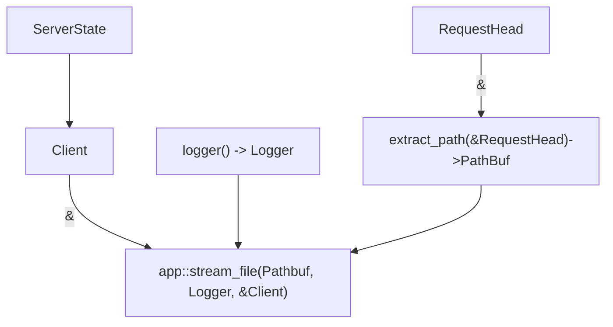

<div align="center">
 
 <br>
 <strong>
   Re-imagining backend development in Rust
 </strong>
</div>

<br>

## What is Pavex?

Pavex is a new framework to build APIs with Rust.  

Pavex aims to have it all: great ergonomics and high performance.   
The same **productivity boost** of Ruby on Rails, Spring or ASP.NET Core.  
As **fast** as a handwritten solution that strips away all abstractions.

Pavex takes a significantly different approach compared to the current generation of Rust web frameworks: you can think of Pavex as a **specialised compiler** for building Rust APIs.  
It takes as input a high-level description of what your application should do, a `Blueprint`:

```rust
pub fn app_blueprint() -> Blueprint {
    let mut bp = Blueprint::new();
    bp.constructor(f!(crate::http_client), Lifecycle::Singleton);
    bp.constructor(f!(crate::extract_path), Lifecycle::RequestScoped);
    bp.constructor(f!(crate::logger), Lifecycle::Transient);
    bp.route(GET, "/home", f!(crate::stream_file));
    bp
}
```

It generates as output a standalone API server SDK crate, behaving according to your specification, ready
to be configured and launched.

### Great error messages

Pavex operates at the **right level of abstraction**—it understands the specific challenges and requirements of API development.  
The intermediate code generation step (`Blueprint` -> runtime code) allows Pavex to perform in-depth static analysis. Potential issues
are caught at compile-time with an **informative error message**:

```text
ERROR:
  × `app::get_home` is trying to extract route parameters using `RouteParams<HomeRouteParams>`.
  │ Every struct field in `app::HomeRouteParams` must be named after one of the route parameters 
  | that appear in `/address/:address_id/home/:home_id`:
  │ - `home_id`
  │ - `address_id`
  │
  │ There is no route parameter named `street_id`, but there is a struct field named
  │ `street_id` in `app::HomeRouteParams`. This is going to cause a runtime error!
  │
  │     ╭─[src/lib.rs:43:1]
  │  43 │     ));
  │  44 │     bp.route(GET, "/home/:id", f!(crate::get_home));
  │     ·                                ───────────┬──────
  │     ·             The request handler asking for `RouteParams<app::HomeRouteParams>`
  │  45 │     
  │     ╰────
  │   help: Remove or rename the fields that do not map to a valid route parameter.
```

### Compile-time dependency injection

Your `Blueprint` tells Pavex:

- What routes should be exposed;
- What components can be built, what inputs they need and what is their lifecycle;
- How to handle errors.

Pavex uses this information to perform **compile-time dependency injection**.  

Each endpoint gets its own **call graph** and Pavex makes sure to **exclusively** build what is required to invoke every single endpoint, 
avoiding unnecessary computations.



You write straight-forward Rust, Pavex takes care of assembling together all the components. 

## Project status

Pavex is under active development and far from being ready for hobby or production usage.  
It has not yet been released on crates.io and you can expect breaking changes on every commit to the `main` branch.

We are aiming for an alpha release by the end of summer 2023.

We publish project updates every 4 weeks:

- [Vision](https://www.lpalmieri.com/posts/a-taste-of-pavex-rust-web-framework/) [December 2022]
- [Progress report #1](https://www.lpalmieri.com/posts/pavex-progress-report-01/) [January 2023]
- [Progress report #2](https://www.lpalmieri.com/posts/pavex-progress-report-02/) [March 2023]
- [Progress report #3](https://www.lpalmieri.com/posts/pavex-progress-report-03/) [April 2023]
- [Progress report #4](https://www.lpalmieri.com/posts/pavex-progress-report-04/) [May 2023]
- [Progress report #5](https://www.lpalmieri.com/posts/pavex-progress-report-05/) [June 2023]


## Examples

You can see Pavex at work in the [`/examples` folder](./examples):

- In [`examples/skeleton/app_blueprint/src/lib.rs`](./examples/skeleton/app_blueprint/src/lib.rs) we specify the app's behavior in
  a `Blueprint`—
  the endpoints it exposes and their request handlers, as well as the required constructors for the application state;
- In [`examples/skeleton/app_blueprint/src/bin.rs`](./examples/skeleton/app_blueprint/src/bin.rs) we serialize the `Blueprint` and
  invoke Pavex's CLI to generate the server code that will execute at runtime, which you can find in
  [`examples/skeleton/app_server_sdk/src/lib.rs`](./examples/skeleeton/app_server_sdk/src/lib.rs).

In [`examples/skeleton/blueprint.ron`](./examples/skeleton/blueprint.ron) you can have a peek at what
the `Blueprint` looks like when serialized.

## Architectural Overview

If the section above was enough to get you intrigued, you can check out the architectural deep-dive
in [`ARCHITECTURE.md`](ARCHITECTURE.md) to learn how Pavex works under the hood.

## Contributing

This project is not open to unsolicited code contributions (for the time being).  
If you want to play around with it, you can find instructions in [`CONTRIBUTING.md`](CONTRIBUTING.md).

## License

Licensed under the Apache License, Version 2.0.
Unless you explicitly state otherwise, any contribution intentionally submitted for inclusion in this crate by you, as
defined in the Apache-2.0 license, shall be licensed as above, without any additional terms or conditions.
