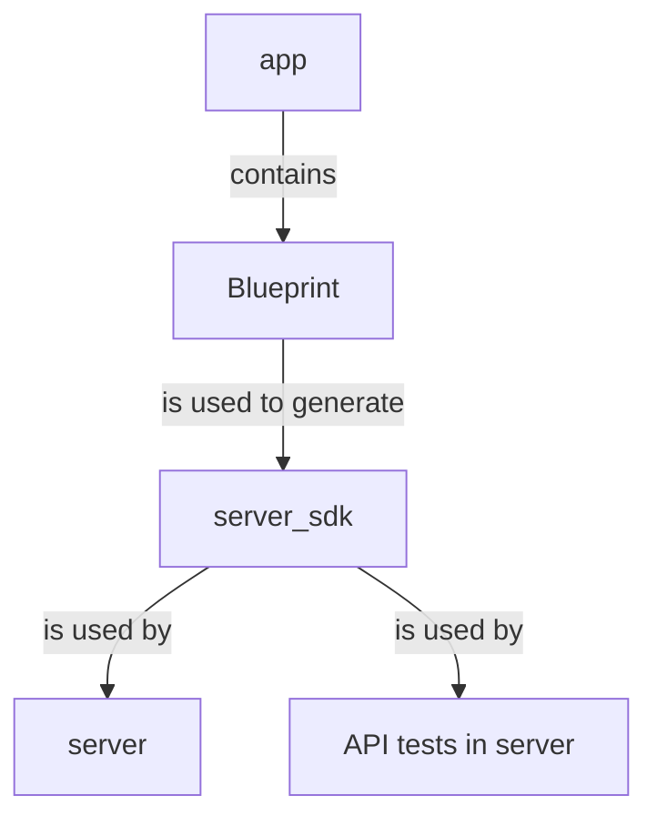

As you have seen in the [Quickstart](../../getting_started/quickstart/index.md) tutorial, 
`pavex new` is a quick way to scaffold a new project and start working on it. 
If you execute 

```bash
pavex new demo
``` 

the CLI will create a project with the following structure:

```text
--8<-- "doc_examples/quickstart/demo-project_structure.snap"
```

What is the purpose of all those folders? Why is [`cargo-px`][cargo-px] needed to build a Pavex project?
Are there any conventions to follow?

This guide will answer all these questions and more.

## Summary

If you're in a hurry, here's a quick summary of the most important points:

- A Pavex project is a [Cargo workspace](https://doc.rust-lang.org/cargo/reference/workspaces.html)
  with at least three crates: 
    - a core crate (_library_), conventionally named `app`
    - a server SDK crate (_library_), conventionally named `server_sdk`
    - a server crate (_binary_), conventionally named `server`
- The `app` crate contains the [`Blueprint`][Blueprint] for your API. It's where you'll spend most of your time.
- The server SDK crate is generated from the core crate by `pavex generate`, which is invoked automatically
  by [`cargo-px`][cargo-px] when building or running the project.
- The server crate is the entry point for your application. It's also where you'll write your integration tests.

Using the `demo` project as an example, the relationship between the project crates can be visualised as follows:



If you want to know more, read on!

## Blueprint

Every Pavex project has, at its core, a [`Blueprint`][Blueprint].  
It's the type you use to declare the structure of your API:
[routes], [middlewares], [constructors], [error handlers], [error observers], etc.

--8<-- "doc_examples/quickstart/demo-blueprint_definition.snap"

Think of a [`Blueprint`][Blueprint] as the specification for your API, a **plan for how your application should behave at
runtime**.

### Code generation

You can't run or execute a [`Blueprint`][Blueprint] as-is.

#### `pavex generate`

To convert a [`Blueprint`][Blueprint] into an executable toolkit, you need `pavex generate`.
It's a CLI command that takes a [`Blueprint`][Blueprint] as input and outputs a
Rust crate, the **server SDK** for your Pavex project.

```text hl_lines="3"
--8<-- "doc_examples/quickstart/demo-project_structure.snap"
```

!!! note

    As a convention, the generated crate is named `server_sdk`.  
    You can use `{project_name}_server_sdk` if you need to disambiguate between
    multiple Pavex applications in the same workspace.

#### `cargo-px`

If you went through the [Quickstart](../../getting_started/quickstart/index.md) tutorial, you might be
wondering: I've never run `pavex generate`! How comes my project worked?

That's thanks to [`cargo-px`][cargo-px]!  
If you look into the `Cargo.toml` manifest for the `server_sdk` crate in the `demo` project,
you'll find this section:

```toml
--8<-- "doc_examples/quickstart/demo-cargo_px_in_manifest.snap"
```

It's a [`cargo-px`][cargo-px] configuration section.  
The `server_sdk` crate is telling [`cargo-px`][cargo-px] to generate the whole crate
by executing a binary called `bp` (short for `blueprint`) from the current Cargo workspace.

That binary is defined in the `demo` crate:

--8<-- "doc_examples/quickstart/demo-bp_binary.snap"

[`Client::generate`][Client::generate] takes care of serializing the [`Blueprint`][Blueprint]
and passing it as input to `pavex generate`.

All this is done automatically for you when you run `cargo px build` or `cargo px run`.
[`cargo-px`][cargo-px] examines all the crates in your workspace, generates the ones
that need it, and then goes on to complete the build process.

## The server SDK

We've talked at length about how the server SDK is generated, but we haven't yet
discussed what it actually _does_.  
The **server SDK is the glue that wires everything together**. It is the code
executed at runtime when a request hits your API.

You can think of it as the output of a macro, with the difference that you can explore it.
It's right there in your filesystem: you can open it, you can read it, you can use it as a way
to get a deeper understanding of how Pavex works under the hood.

At the same time, you actually don't need to know how it works to use it.  
As a Pavex user, **you only need to care about** the two public types it exports: **the `run` function and the `ApplicationState`
struct**.

### `ApplicationState`

`ApplicationState` holds all the types with a [`Singleton` lifecycle][Lifecycle::Singleton]
that your application needs to access at runtime when processing a request.

To build an instance of `ApplicationState`, the server SDK exposes a function called `build_application_state`.

### `run`

`run` is the entrypoint of your application.  
It takes as input:

- an instance of `ApplicationState`
- a [`pavex::server::Server`][Server] instance

[`pavex::server::Server`][Server] holds the configuration for the HTTP server that will be used to serve your API:
the port(s) to listen on, the number of worker threads to be used, etc.  
When you call `run`, the HTTP server starts listening for incoming requests.
You're live!

## The server crate

But who calls `run`?

The server SDK crate is a library, it doesn't contain an executable binary.  
That's why you need a **server crate**.

```text hl_lines="2"
--8<-- "doc_examples/quickstart/demo-project_structure.snap"
```

!!! note

    As a convention, the server crate is named `server`.  
    You can use `{project_name}_server` if you need to disambiguate between
    multiple Pavex applications in the same workspace.

### The executable binary

The server crate contains the `main` function that you'll be running to start your application.  
In that `main` function you'll be building an instance of `ApplicationState` and passing it to `run`.
You'll be doing a few other things too: initializing your `tracing` subscriber, loading
configuration, etc.

??? info "The `main` function in `server`"

    --8<-- "doc_examples/quickstart/demo-bp_server_binary.snap"

Most of this ceremony is taken care for you by the `pavex new` command, but it's good to know
that it's happening (and where it's happening) in case you need to customize it.

### Integration tests

The server crate is also where you'll be writing your **API tests**, also known as **black-box tests**.  
These are scenarios that exercise your application as a customer would, by sending HTTP requests and asserting on the
responses.

The `demo` project includes an example of such a test which you can use as a reference:

--8<-- "doc_examples/quickstart/demo-ping_test.snap"

[Blueprint]: ../../api_reference/pavex/blueprint/struct.Blueprint.html
[Client::generate]: ../../api_reference/pavex_cli_client/client/struct.Client.html#method.generate
[Lifecycle::Singleton]: ../../api_reference/pavex/blueprint/constructor/enum.Lifecycle.html#variant.Singleton
[Server]: ../../api_reference/pavex/server/struct.Server.html

[routes]: ../routing/index.md
[constructors]: ../dependency_injection/index.md
[middlewares]: ../middleware/index.md
[error handlers]: ../errors/error_handlers.md
[error observers]: ../errors/error_observers.md
[cargo-px]: https://github.com/LukeMathWalker/cargo-px
