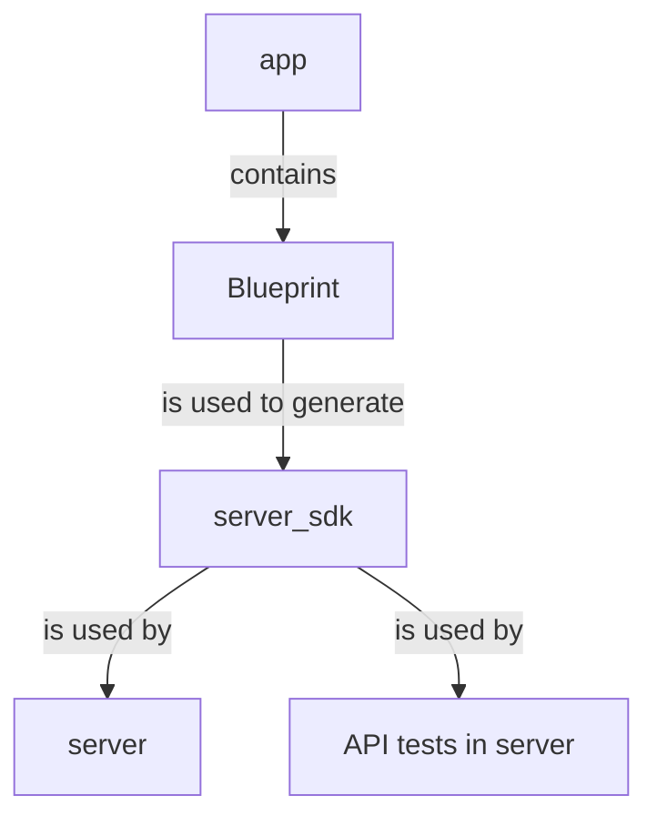

# Project structure

As you have seen in the [Quickstart](/getting_started/quickstart/index.md) tutorial,
`pavex new` is a quick way to scaffold a new project and start working on it.
If you execute

```bash
pavex new demo
```

the CLI will create a project with the following structure:

```text
--8<-- "doc_examples/quickstart/demo-project_structure.snap"
```

What is the purpose of all those folders? Why is [`cargo-px`][cargo-px] needed to build a Pavex project?
Are there any conventions to follow?

This guide will answer all these questions and more.

## Summary

If you're in a hurry, here's a quick summary of the most important points.\
A Pavex project is a [Cargo workspace](https://doc.rust-lang.org/cargo/reference/workspaces.html)
with at least three crates:

- [An application crate](app.md) (_library_), conventionally named `app`.\
  It contains the [`Blueprint`][Blueprint] for your API. It's where you'll spend most of your time.
- [A server SDK crate](server_sdk.md) (_library_), conventionally named `server_sdk`.\
  It's generated by `pavex generate`, which is invoked under the hood by [`cargo-px`][cargo-px] when building or running the project.
  **You should never modify the generated code**—your manual changes will be overwritten.
- [A server crate](server.md) (_binary_), conventionally named `server`.\
  It is the entrypoint for your application.
  You'll have to change if you want to tweak the binary entrypoint (e.g. modify the default telemetry setup).
  Your integration tests live in this crate.

Using the `demo` project as an example, the relationship between the project crates can be visualised as follows:



If you want to know more, read on!

[Blueprint]: /api_reference/pavex/blueprint/struct.Blueprint.html
[cargo-px]: https://github.com/LukeMathWalker/cargo-px
